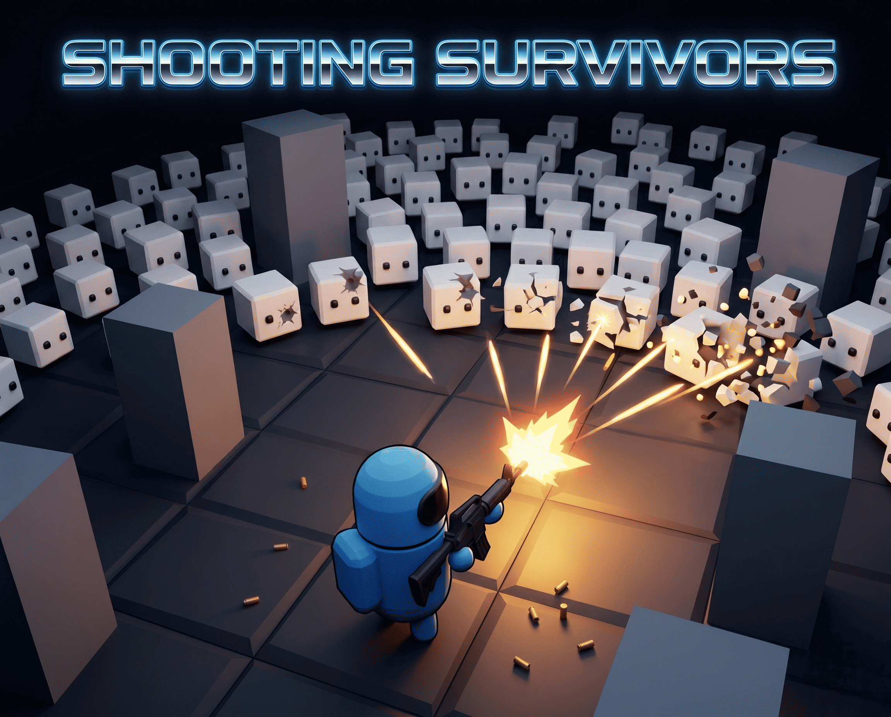
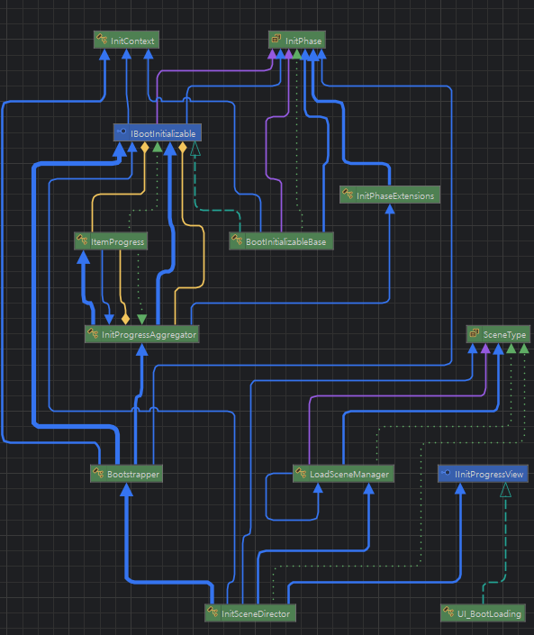
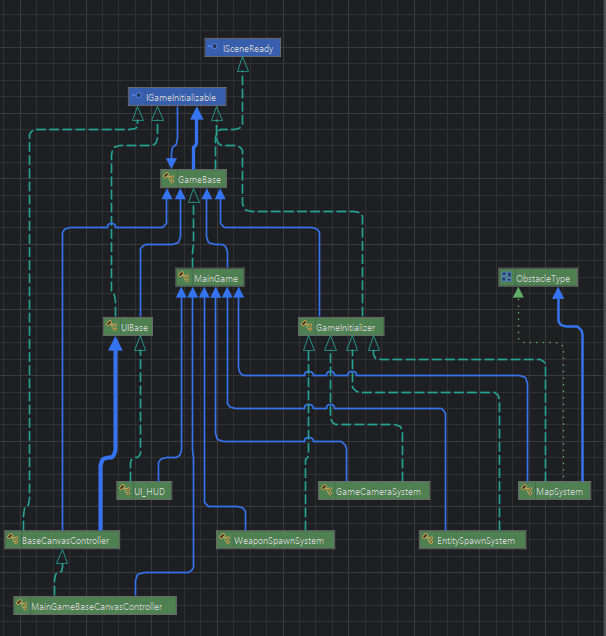
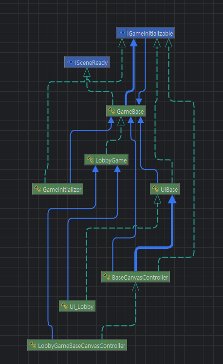
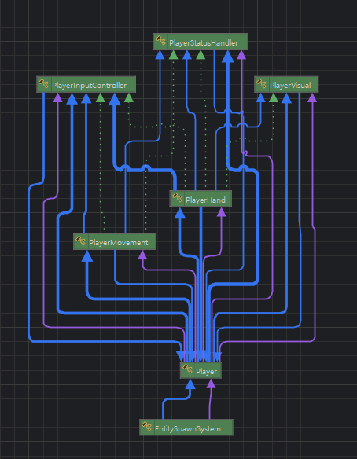
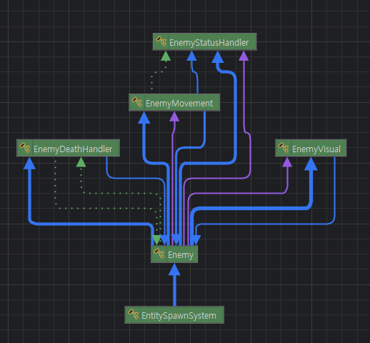

# 3D Sample Project

**한국어** | [English](README.en.md)

> Unity 6 기반 탑다운 3D 서바이벌 슈터.
>  **재사용 가능한 자체 게임 프레임워크를 설계하고 그 위에 게임을 얹은** 프로젝트입니다.

<p>
  
  
  
  
  
</p>

<p align="center">
    
</p>

<p align="center">
  <a href="https://deff-s.itch.io/shooting_survivors">
    
  </a>
</p>

---


## 🛠 기술 스택

`Unity 6` · `C#` · `URP` · `UniTask` · `Addressables` · `Cinemachine` ·
`Input System` · `DOTween` · `TextMesh Pro` · `Newtonsoft.Json`

---

## 🧩 두 개의 레이어

코드는 **재사용 가능한 엔진 레이어(`Framework`)** 와 **그 위에 얹은 게임 고유 로직(`Game`)** 으로 나뉩니다.

<br>

<details open>
<summary><h3>🧱 Framework — 재사용 엔진 레이어 (펼치기/접기)</h3></summary>

> 게임 종류와 무관하게 재사용 가능한 엔진 토대. 부팅 · 초기화 · 리소스 · UI · 이벤트 · 풀링 · 세이브를 추상화했습니다.

### 📂 구조

```
Assets/_Dev/_Scripts/Framework/
├── Core/           부팅·초기화 파이프라인 (Bootstrapper, GameBase, Initialization/)
├── Addressable/    리소스 매니저 + 에디터 코드 생성 도구
├── Event/          struct 기반 이벤트 버스
├── Pool/           Addressable 오브젝트 풀
├── Save/           AES 암호화 + JSON/Newtonsoft 세이브
├── Scene/          씬 전환 (트랜지션 연출 포함)
├── Singleton/      싱글톤 베이스 3종
└── UI/             캔버스/UI 베이스 + 메타태그 기반 자동 등록
```

### 🏛 아키텍처 하이라이트

#### ① 일관된 부팅 파이프라인 — [`Bootstrapper`](Assets/_Dev/_Scripts/Framework/Core/Bootstrapper.cs)
- `"Bootstrap"` 라벨이 붙은 영구 프리팹(매니저/SDK)을 Addressables로 **자동 수집·생성**
- `IBootInitializable`을 **Phase → Order**로 정렬: 같은 단계는 **병렬**, 다른 단계는 **배리어로 순차** 실행
- **재시도 + 필수/선택 실패 정책** — 필수 항목 실패 시 부팅 중단, 선택 항목은 건너뛰고 진행
- `EnsureReady()`를 `UniTask?`로 1회 캐싱 → **어느 씬에서 Play해도 동일하게 초기화**
  (에디터에서 특정 씬만 단독 실행 가능)

#### ② 씬 단위 게임 수명주기 — [`GameBase`](Assets/_Dev/_Scripts/Framework/Core/GameBase.cs)
- `PreInitialize → SpawnSystemContainer → InitializeSystems → PostInitialize → OnSceneOpened`
  의 **템플릿 메서드 패턴**으로 모든 씬 게임 컨트롤러를 통일
- 시스템들도 `InitOrder` 기반 **병렬/순차 배리어** 초기화 (Bootstrapper와 동일 철학)
- 트랜지션 구동 중이면 자가 부팅을 양보, 아니면 스스로 부팅 → **씬 독립 실행성**

#### ③ struct 기반 이벤트 버스 — [`EventManager`](Assets/_Dev/_Scripts/Framework/Event/EventManager.cs)
- 시스템 간 **직접 참조 0** — 모든 통신을 `OnPlayerDeadEvent` 같은 **struct 메시지**로 (박싱/GC 최소화)
- 일반 발행/구독뿐 아니라 **요청-응답(Func) 패턴**까지 지원

#### ④ 메타태그 기반 UI 자동화 — [`UIMetaTag`](Assets/_Dev/_Scripts/Framework/UI/Meta/UIMetaTag.cs) → [코드 생성](Assets/_Dev/_Scripts/Framework/Addressable/Editor/AddressableKeyGenerator.cs)
- 프리팹에 `UIMetaTag`(owner / 프리로드 / 시작 시 오픈 / 언락 조건) 부착
- 에디터 메뉴 한 번으로 **`UIKeys` · `UI_REGISTRY` C# 코드 자동 생성**
- 캔버스 컨트롤러는 레지스트리를 읽어 **자기 그룹 UI만 자동 프리로드·오픈**
  → `enum 스위치`나 별도 스폰 설정 SO 없이 **데이터 주도**로 동작
- **콘텐츠 조건부 로드로 스폰 최소화** — 각 UI 의 `requireContent`(ContentType 비트플래그)를
  `CheckContent()` 로 판정해, **현재 씬에서 풀린 콘텐츠의 UI만** 프리로드. 잠긴/비활성 콘텐츠 UI는
  애초에 메모리에 올리지 않아 불필요한 인스턴스 생성을 차단

#### ⑤ 이중 스코프 리소스 관리 — [`AddressableManager`](Assets/_Dev/_Scripts/Framework/Addressable/AddressableManager.cs) / [`AddressablePoolManager`](Assets/_Dev/_Scripts/Framework/Pool/AddressablePoolManager.cs)
- **Scene 스코프 / Global 스코프** 핸들 분리 → 씬 전환 시 씬 전용 리소스만 자동 해제 (누수 방어)
- 풀은 `epoch` 카운터로 **로드 도중 씬이 바뀌면 뒤늦게 끝난 로드 결과를 폐기**(누수 방어), `_loading` 딕셔너리로 동시 로드 중복 방지
- 모든 풀 대상을 `PoolObject`로 묶어 **단일 딕셔너리로 관리** → 새 타입이 추가돼도 매니저 코드 수정 불필요. 풀에서 하위 클래스로 꺼낼 때 `GetComponent` 대신 **`obj as T` 참조 캐스팅**으로 비용 최소화

#### ⑥ 로컬 세이브 — [`AESCrypto`](Assets/_Dev/_Scripts/Framework/Save/AESCrypto.cs)
- AES로 세이브 데이터를 암호화해 **단순 변조를 어렵게** 함 (키/IV는 기기 로컬 저장)
- JSON / Newtonsoft 2가지 직렬화 백엔드 제공

### 🧭 부팅 · 초기화 파이프라인 다이어그램
[`Bootstrapper`](Assets/_Dev/_Scripts/Framework/Core/Bootstrapper.cs) 가 [`IBootInitializable`](Assets/_Dev/_Scripts/Framework/Core/Initialization/IBootInitializable.cs) 들을 [`InitPhase`](Assets/_Dev/_Scripts/Framework/Core/Initialization/InitPhase.cs) 순으로 구동하고, [`LoadSceneManager`](Assets/_Dev/_Scripts/Framework/Scene/LoadSceneManager.cs) · [`InitSceneDirector`](Assets/_Dev/_Scripts/Framework/Core/Initialization/InitSceneDirector.cs) 가 씬 전환·로딩 UI를 연결합니다.



### 🧰 자작 에디터 생산성 도구

> 각 도구 이름을 클릭하면 스크린샷 포함 **상세 페이지**로 이동합니다.

| 도구 | 역할 |
|---|---|
| [**Addressable Manager**](docs/tools/addressable-manager.md) | 프리팹 그룹 등록·라벨 부착 후 `ADR_KEY` / `UI_KEY` / `UI_REGISTRY` 코드까지 한 번에 생성 |
| [**Scene Selector**](docs/tools/scene-selector.md) | 단축키로 Prod/Test 씬 즉시 Open·Play (검색 폴더 커스터마이즈) |
| [**Folder Navigation**](docs/tools/folder-navigation.md) | 자주 쓰는 폴더 즐겨찾기 등록·빠른 이동 |
| [**Audio Trimmer**](docs/tools/audio-trimmer.md) | 에디터에서 오디오 클립 트림 + 파형 미리듣기 + WAV 저장 |

</details>

<details>
<summary><h3>🎮 Game — 게임 고유 로직 (펼치기/접기)</h3></summary>

> 위 프레임워크 추상 위에 얹은 "Shooting Survivors" 게임 구현. `GameBase` / `UIBase` / 이벤트 버스를 그대로 재사용합니다.

### 📂 구조

```
Assets/_Dev/_Scripts/Game/
├── Behaviors/      Player / Enemy / Weapon (컴포지션 구조)
├── GameCore/       MainGame / LobbyGame
├── Systems/        Spawn / Map / Camera
├── UI/             HUD / Result / Lobby
└── Events/         게임 이벤트 struct 정의
```

### 🕹 게임 플로우

```
Initialize 씬 (부팅 · 로딩 UI)
  └─ Bootstrapper: "Bootstrap" 라벨 영구 매니저 생성·초기화
       └─ Lobby 씬 (LobbyGame): 시작 UI
            └─ 트랜지션 연출과 함께 Game 씬 전환
                 └─ MainGame: Map · Spawn · Camera 시스템 초기화
                      └─ 커튼 열림 → OnGameStartEvent → 플레이 시작
                           └─ 적과 충돌 시 게임오버 → 결과 팝업
```

플레이어는 사방에서 카메라 밖 원형 링으로 몰려오는 적을 **마우스로 조준해 사격**하여 처치하고,
맵은 플레이어를 따라 무한히 이어집니다.

### 🏛 아키텍처 하이라이트

#### ① 컴포지션 기반 캐릭터 — [`Player`](Assets/_Dev/_Scripts/Game/Behaviors/Player/Player.cs) / [`Enemy`](Assets/_Dev/_Scripts/Game/Behaviors/Enemy/Enemy.cs)
- 루트 MonoBehaviour가 **순수 C# 컴포넌트**(Status / Movement / Visual / Death …)를 생성·초기화하고,
  `Update / FixedUpdate` 틱만 대신 구동
- 상속이 아닌 **컴포지션 + 명시적 의존성 순서** → 테스트·재사용 용이, Player와 Enemy가 동일 패턴

#### ② 무한 맵 — [`MapSystem`](Assets/_Dev/_Scripts/Game/Systems/Map/MapSystem.cs)
- N×N 타일을 고정 개수로 두고 플레이어를 따라 **칸 단위 재배치(타일 재활용)**
- 셀 좌표를 시드로 한 **결정론적 장애물 배치**(같은 칸 = 항상 같은 모양)
- `HashSet` / `List` 버퍼 재사용으로 매 프레임 GC 회피

#### ③ 시스템 조립 — [`EntitySpawnSystem`](Assets/_Dev/_Scripts/Game/Systems/Spawn/EntitySpawnSystem.cs) / [`WeaponSpawnSystem`](Assets/_Dev/_Scripts/Game/Systems/Spawn/WeaponSpawnSystem.cs) / [`GameCameraSystem`](Assets/_Dev/_Scripts/Game/Systems/Camera/GameCameraSystem.cs)
- 각 시스템이 `IGameInitializable` 로 컨테이너에 담겨 `GameBase` 가 순서대로 초기화
- 적 풀링·원형 링 소환·뒤처진 적 재배치, 무기 스폰, Cinemachine 카메라 연결까지 분리된 책임으로 구성

### 🧭 시스템 / 캐릭터 다이어그램

**게임 씬 시스템 구조 ([MainGame](Assets/_Dev/_Scripts/Game/GameCore/MainGame.cs))** — [`GameBase`](Assets/_Dev/_Scripts/Framework/Core/GameBase.cs) 템플릿 위에서 `IGameInitializable` 시스템들과 캔버스 컨트롤러가 조립됩니다.



**로비 씬 구조 ([LobbyGame](Assets/_Dev/_Scripts/Game/GameCore/LobbyGame.cs))** — 동일한 [`GameBase`](Assets/_Dev/_Scripts/Framework/Core/GameBase.cs) / [`UIBase`](Assets/_Dev/_Scripts/Framework/UI/Core/UIBase.cs) 추상을 재사용한 사례.



**캐릭터 컴포지션 — Player / Enemy** — 루트 매니저가 순수 C# 컴포넌트를 소유·구동하는 동일 패턴.

| Player | Enemy |
|:---:|:---:|
|  |  |

</details>

---


