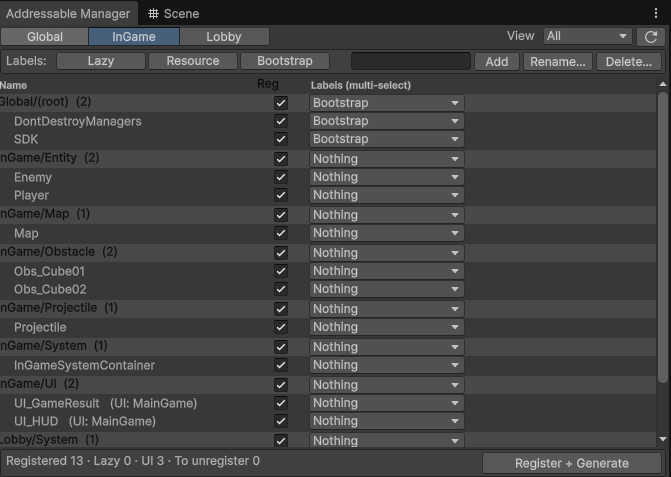

# 🧰 Addressable Manager

> 프리팹의 **Addressable 그룹 등록 · 라벨 부착 · 코드 생성**을 한 창에서 끝내는 자작 에디터 도구.
> Addressables 의 번거로운 수작업(그룹 만들기 → 엔트리 이동 → 라벨 토글 → 키 상수 직접 타이핑)을 제거합니다.

**메뉴:** `Game / Addressable / Addressable Manager`



---

## 무엇을 하나

- `_Dev/_Resources/{Global, InGame, Lobby}` 아래 프리팹을 **탭 · 폴더별로 스캔**해 한눈에 표시
- **주소(Address)를 파일명으로 자동 정리** — Addressable 은 기본적으로 에셋을 **전체 경로**로 등록한다
  (예: `Assets/_Dev/_Resources/InGame/UI/UI_HUD.prefab`). 이 툴은 등록 시 주소를 **프리팹 이름**(`UI_HUD`)으로 바꿔
  `LoadAssetAsync("UI_HUD")` 처럼 **짧고 직관적인 키로 로드**할 수 있게 한다 → 경로가 바뀌어도 코드 영향 없음
- 행마다 **Reg(등록) 토글 + 라벨 멀티 토글(MaskField)** — 클릭만으로 그룹 등록/해제, 라벨 부착
- **폴더 단위 일괄 정책** — 폴더에 건 등록/라벨 기본값을 `AddressableManagerConfig`(ScriptableObject)에 저장해 **VCS로 공유**. 새 프리팹은 폴더 정책을 자동 상속
- `UIMetaTag` 가 붙은 프리팹은 **UI로 자동 인식**하고 owner 그룹을 함께 표시
- 라벨 **추가 / 이름변경 / 삭제** 지원 (`Lazy` 라벨은 보호)
- View 모드: **ByFolder / All / ByLabel**

## Register + Generate 

하단 버튼 한 번이 다음을 순차 실행합니다:

1. 선택한 프리팹을 해당 **Addressable 그룹에 등록/이동**, 주소를 파일명으로 설정
2. 토글한 **라벨을 실제 엔트리에 반영**(원치 않는 라벨 제거 포함)
3. [`AddressableKeyGenerator.Generate()`](../../Assets/_Dev/_Scripts/Framework/Addressable/Editor/AddressableKeyGenerator.cs) 호출 →
   **`ADR_KEY` · `UI_KEY` · `UI_REGISTRY` C# 코드 자동 생성**

> 즉 **Key Generator 는 독립 메뉴가 아니라 이 창의 마지막 단계**입니다.
> 덕분에 리소스 키를 문자열로 직접 타이핑하다 오타 내는 실수를 줄일 수 있습니다.

## 생성되는 파일

`Register + Generate` 를 누르면 `Assets/_Addressable/Generated/` 아래 세 파일이 갱신됩니다. **모두 자동 생성물이라 직접 수정하지 않습니다.**

| 파일 | 내용 |
|---|---|
| [`ADR_KEY.cs`](../../Assets/_Addressable/Generated/ADR_KEY.cs) | `Lazy` 라벨이 붙은 일반 리소스의 주소 상수 (`public const string`) |
| [`UI_KEY.cs`](../../Assets/_Addressable/Generated/UI_KEY.cs) | `UIMetaTag` 가 붙은 UI 프리팹의 타입 세이프 키 (`UIKey`) |
| [`UI_REGISTRY.cs`](../../Assets/_Addressable/Generated/UI_REGISTRY.cs) | UI 프리팹의 owner·프리로드·오픈 조건을 담은 메타 테이블 |

### 예시 — `UI_KEY.cs`

UI 프리팹 3개(`UI_GameResult`, `UI_HUD`, `UI_Lobby`)가 있을 때 생성되는 결과:

```csharp
// 자동 생성된 파일입니다. (Game/Addressable/Generate Addressable Keys)
public static class UIKeys
{
    public static readonly UIKey UI_GameResult = new UIKey("UI_GameResult");
    public static readonly UIKey UI_HUD = new UIKey("UI_HUD");
    public static readonly UIKey UI_Lobby = new UIKey("UI_Lobby");
}
```

이제 코드에서 `"UI_HUD"` 문자열 대신 **`UIKeys.UI_HUD`** 로 참조 → 오타 시 컴파일 에러로 즉시 발견됩니다.
같은 정보가 [`UI_REGISTRY.cs`](../../Assets/_Addressable/Generated/UI_REGISTRY.cs) 에서는 owner/프리로드 플래그까지 묶인 테이블로 생성되어, 캔버스 컨트롤러가 이를 읽어 **자기 그룹 UI만 자동 등록**합니다.

## 관련 코드

- [`AddressableManagerWindow`](../../Assets/_Dev/_Scripts/Framework/Addressable/Editor/AddressableManagerWindow.cs) — 메인 UI
- [`AddressableKeyGenerator`](../../Assets/_Dev/_Scripts/Framework/Addressable/Editor/AddressableKeyGenerator.cs) — 키/레지스트리 코드 생성
- [`AddressableManagerConfig`](../../Assets/_Dev/_Scripts/Framework/Addressable/AddressableManagerConfig.cs) — 폴더별 정책 SO
- [`AddressableRenameTool`](../../Assets/_Dev/_Scripts/Framework/Addressable/Editor/AddressableRenameTool.cs) — 에셋 이름 정리

[⬅ README 로 돌아가기](../../README.md)
