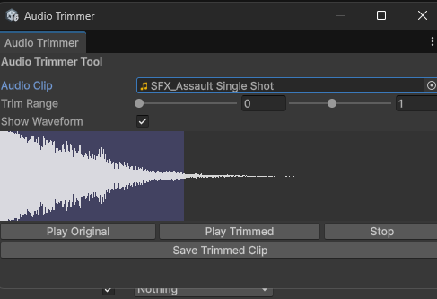

# 🎚 Audio Trimmer

> 에디터 안에서 **오디오 클립을 잘라 미리 듣고 WAV 로 저장**하는 창. 외부 오디오 편집기를 오가지 않고 짧은 효과음/구간을 바로 추출합니다.

**메뉴:** `Tools / SD / Audio Trimmer Tool`

---

## 무엇을 하나

- `AudioClip` 을 선택하고 **Trim Range 슬라이더**로 시작/끝 지점 지정
- **파형(Waveform) 시각화**로 구간을 눈으로 확인
- **Play Original / Play Trimmed / Stop** 으로 원본·잘린 구간을 즉시 청취
- 잘라낸 구간을 **WAV 파일로 저장**

## 관련 코드

- [`AudioTrimmerEditor`](../../Assets/_Dev/_Scripts/Utils/Editor/AudioTrimmer/AudioTrimmerEditor.cs) — 트림 UI / 파형 / 재생
- [`SaveWav`](../../Assets/_Dev/_Scripts/Utils/Editor/AudioTrimmer/SaveWav.cs) — WAV 인코딩/저장

[⬅ README 로 돌아가기](../../README.md)
