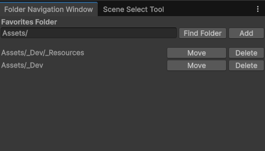

# 📁 Folder Navigation

> 자주 쓰는 프로젝트 폴더를 **즐겨찾기로 등록해 바로 이동**하는 창. 깊은 폴더 구조를 매번 펼쳐 들어가는 수고를 줄여줍니다.

**메뉴:** `Tools / SD / Folder Navigation`

---

## 무엇을 하나

- 폴더 경로를 직접 입력하거나 **폴더 피커(Find Folder)** 로 선택해 즐겨찾기에 추가
- 등록한 폴더를 목록에서 **클릭 한 번으로 이동/포커스**
- 즐겨찾기 목록은 저장되어 에디터를 다시 열어도 유지

## 관련 코드

- [`FolderNavigationWindow`](../../Assets/_Dev/_Scripts/Utils/Editor/DevTools/FolderNavigationWindow.cs)

[⬅ README 로 돌아가기](../../README.md)
