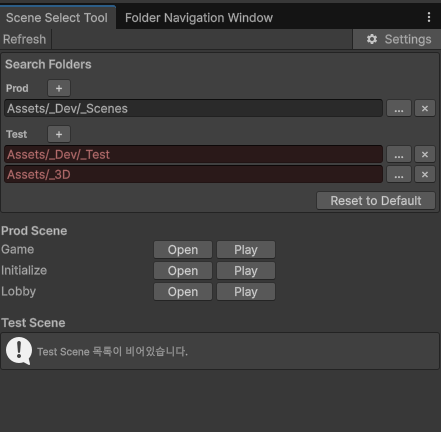

# 🎬 Scene Selector

> 자주 쓰는 씬을 **단축키 한 번으로 열고/플레이**하는 창. 프로젝트 탐색기에서 씬 파일을 찾는 시간을 줄여줍니다.

**메뉴:** `Tools / SD / Scene Select` · **단축키:** `Shift + Ctrl + Q`

---

## 무엇을 하나

- **Prod / Test** 두 그룹으로 씬을 분류해 목록 표시
- 각 씬마다 **Open**(열기) · **Play**(열고 즉시 플레이모드 진입) 버튼
- Open/Play 전 **저장 안 된 변경사항 확인**(데이터 유실 방지)
- **검색 폴더 커스터마이즈** — Prod/Test 가 스캔할 폴더를 직접 추가/삭제, 폴더 피커 지원
  - 설정은 `EditorPrefs` 에 **프로젝트별로 분리 저장**(`Application.dataPath` 해시 기반)
  - 존재하지 않는 폴더는 **빨강으로 강조**해 설정 오류를 즉시 인지

## 관련 코드

- [`SceneSelectorWindow`](../../Assets/_Dev/_Scripts/Utils/Editor/DevTools/SceneSelectorWindow.cs)

[⬅ README 로 돌아가기](../../README.md)
